# spark-lab

## Постановка задачи

Целью данной лабораторной работы является развертывание распределенной файловой системы Hadoop (HDFS) и кластера вычислений Spark в среде Docker, а также анализ влияния методов оптимизации на производительность обработки данных.

В качестве исходных данных используется датасет [`e-commerce-events-history`](https://www.kaggle.com/datasets/mkechinov/ecommerce-events-history-in-cosmetics-shop) (история событий в магазине косметики) из прошлой лабораторной работы, содержащий более 1 миллиона строк (исходный вес примерно 400 МБ).

В качестве бизнес-задачи для проведения экспериментов был разработан многоэтапный аналитический пайплайн. Он имитирует создание витрины данных для маркетологов и состоит из следующих шагов:

1. Расчет базовой статистики по категориям. Мы просматриваем все исторические данные платформы и вычисляем для каждой товарной категории среднюю, минимальную и максимальную цены, а также общее количество взаимодействий.
2. Составление профилей покупателей. Мы анализируем активность каждого уникального пользователя: считаем, сколько всего действий он совершил, сколько разных категорий товаров затронул и каков его личный средний чек.
3. Поиск востребованных товаров среди «китов». Мы отбираем группу самых активных пользователей, совершивших более 50 действий на сайте, и сопоставляем этот список с исходной историей событий. Это позволяет узнать, с какими конкретно товарами чаще всего взаимодействует элитная аудитория.
4. Внутрикатегорийное ранжирование. Опираясь на выбор «китов», мы составляем рейтинг популярности продуктов и оставляем только топ-5 самых востребованных товаров внутри каждой отдельной категории.
5. Финальное объединение данных. Мы берем полученный список из пяти лучших товаров для каждой категории и сопоставляем его с базовой ценовой статистикой из первого этапа, чтобы получить итоговую таблицу для дальнейшего анализа.

## Инструкция по запуску

В ходе лабораторной работы требуется запустить несколько экспериментов с разными параметрами. Далее будут представлены все необходимые для запуска команды, и также команды для проверки работы софта.

Сначала нужно скачать данные с гуглдиска (на гитхаб они не помещаются) и настроить виртуальное окружение (venv). Для этого достаточно выполнить команду:
```bash
./prepare_env.sh
```

Дождаться скачивания, после этого можно перейти к экспериментам.

### Мониторинг

В проекте есть Hadoop и Spark. У обоих есть Web-интерфейс, с помощью которого можно глянуть разную статистику по обоим фреймворкам.

#### Hadoop

Чтобы открыть мониторинг Hadoop, посмотреть количество `NameNode`, работу `DataNode`, а также проверить наличие файлов в системе (и также глянуть количество блоков), достаточно зайти по следующему url:
- [http://localhost:9870](http://localhost:9870)

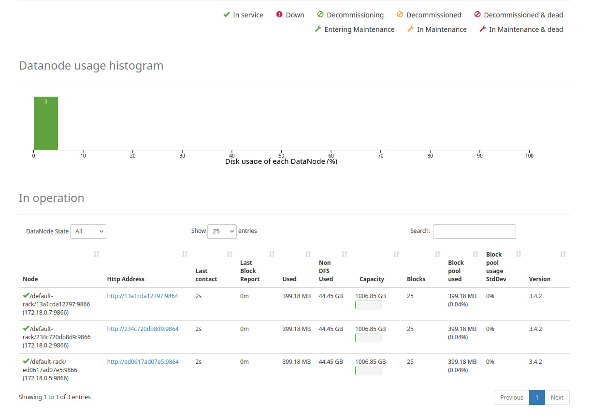

#### Spark

Также можно посмотреть все таски, выполняемые Spark, и состояние воркеров. Для этого нужно посетить [http://localhost:8081](http://localhost:8081).

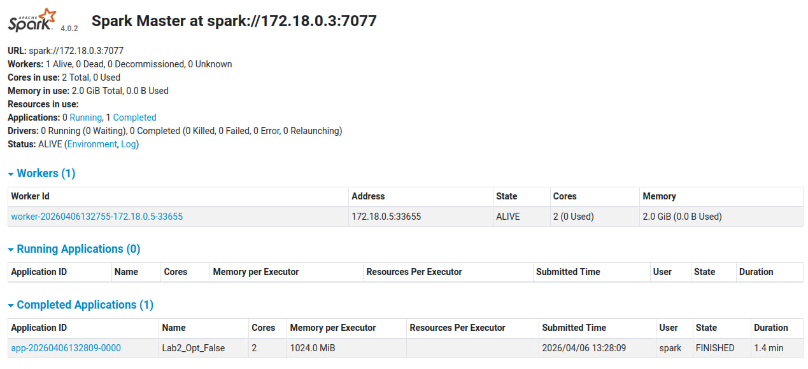

Чтобы глянуть состояние определённой таски сразу же после выполнения (у вас 1 минута есть на отслеживание состояния), нужно перейти по адресу [http://localhost:4041/](http://localhost:4041/). Тут полезны два раздела -- Executors и Stages.

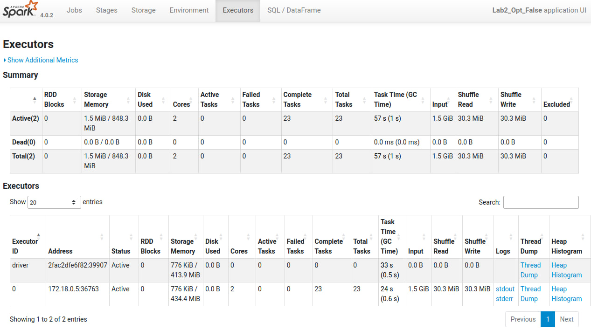


### Эксперименты

Чтобы запустить все эксперименты подряд одним скриптом, нужно запустить следующую команду (чтобы запустить эксперимент с `--multiply N`, нужно просто поменять в скрипте параметр `MULTIPLY_FACTOR`):
```bash
./run_all.sh
```

После этого можно просто подождать выполнения всех экспериментов и получить хитмапу с производительностью по каждому этапу в `report/images/metrics_heatmap.png` и сами метрики по пути `report/metrics_report.json`.

Если хочется запустить отдельно каждый эксперимент и посмотреть их производительность, можно запустить команды ниже:

1. Эксперимент с базовым Hadoop (1 NameNode, 1 DataNode, 1 SparkWorker, без оптимизаций)
```bash
docker compose up -d
./setup_hdfs.sh
./run_experiment.sh
```

2. Эксперимент с базовым Hadoop и мощным Spark (1 NameNode, 1 DataNode, 1 SparkWorker, с оптимизацией)
```bash
docker compose up -d
./setup_hdfs.sh
./run_experiment.sh --optimized
```

3. Эксперимент с несколькими нодами (1 NameNode, 3 DataNode, 3 SparkWorker, без оптимизаций)
```bash
REPLICATION_FACTOR=3 docker compose up -d --scale datanode=3 --scale spark-worker=3
./setup_hdfs.sh
./run_experiment.sh --nodes 3
```

4. Эксперимент с несколькими нодами и оптимизированным Spark (1 NameNode, 3 DataNode, 3 SparkWorker, с оптимизациями)
```bash
REPLICATION_FACTOR=3 docker compose up -d --scale datanode=3 --scale spark-worker=3
./setup_hdfs.sh
./run_experiment.sh --nodes 3 --optimized
```

#### Дополнительно

Для того, чтобы завершить любой из экспериментов, просто нажмите `Ctrl+C` (для отмены `./run_experiment.sh`) в консоли и потом выполните:
```bash
docker compose down -v
```

Также, чтобы проверить производительность на больших массивах данных, есть ключ `--multiply N` у скрипта `./run_experiment.sh`. Он заставляет воркеров дублировать данные `N-1` раз (да, именно воркеров). С параметром `--multiply 3` можно уже попробовать получить представление о нагрузке данных для тех или иных конфигураций.

## Полученные результаты

Основная статистика для базового датасета (х1) показывает, что кэширование и репартиция данных работают по-разному в зависимости от количества узлов. На кластере из нескольких машин это дает прирост скорости, а на одной машине добавляет накладные расходы.

| Эксперимент       | Описание                 | Время выполнения (сек) | Storage RAM (MB) |
| :---------------- | :----------------------- | ---------------------: | ---------------: |
| `1Node_Opt-False` | "1 узел, базовая версия" |                  35.82 |            81.58 |
| `3Node_Opt-False` | "3 узла, базовая версия" |                  26.52 |            85.82 |
| `1Node_Opt-True`  | "1 узел, с оптимизацией" |                  26.72 |            72.13 |
| `3Node_Opt-True`  | "3 узла, с оптимизацией" |                  22.27 |            83.77 |

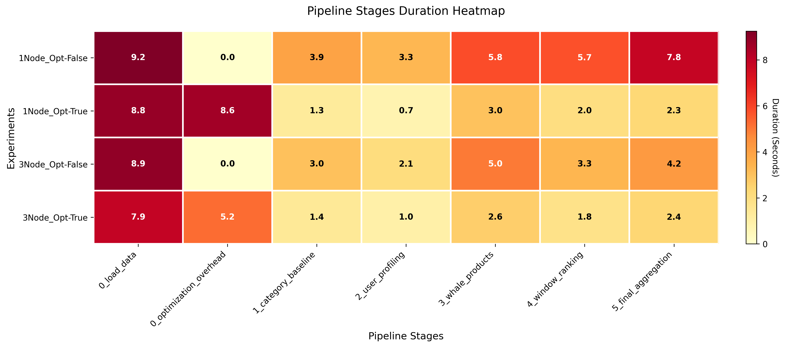

Статистика из вкладок Executors, Stages и Jobs в Web UI показывает, как именно распределялась нагрузка:

| Эксперимент       | Прочитано с диска (Input) | Данные в кэше (Storage Memory) | Shuffle Read | Shuffle Write | Кол-во Jobs | Кол-во Tasks |
| :---------------- | ------------------------: | -----------------------------: | -----------: | ------------: | ----------: | -----------: |
| `1Node_Opt-False` |                   3.9 GiB |                        5.2 MiB |     96.1 MiB |      96.1 MiB |          29 |           66 |
| `1Node_Opt-True`  |                   1.9 GiB |                      114.0 MiB |    142.7 MiB |     142.7 MiB |          23 |           88 |
| `3Node_Opt-False` |                   3.9 GiB |                        8.4 MiB |    101.4 MiB |     101.4 MiB |          29 |          106 |
| `3Node_Opt-True`  |                   1.9 GiB |                      113.5 MiB |    144.3 MiB |     144.3 MiB |          23 |          228 |

Разбор экспериментов на основе Web UI:

* Запуск `1Node_Opt-False`. Показатель `Input` составил `3.9 GiB`, хотя сам файл весит около 400 МБ. Это происходит из-за того, что Spark не кэширует данные и читает файл с диска заново для каждого нового этапа вычислений. В памяти осталось всего `5.2 MiB`, так как данные обрабатывались и сразу удалялись. Из-за последовательного выполнения 29 `Jobs` без распараллеливания общее время составило 35.82 сек.
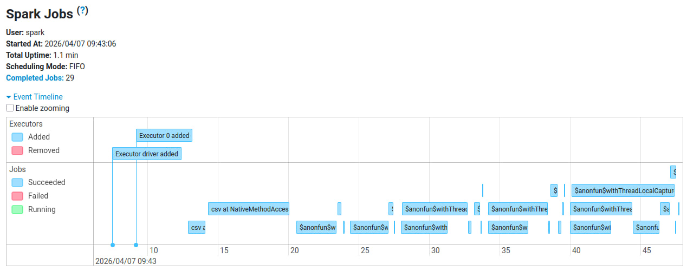
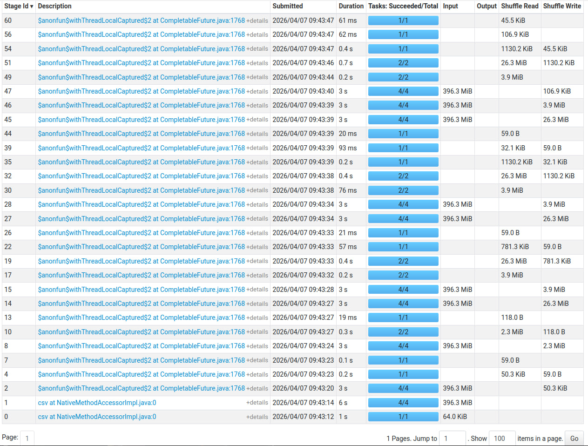
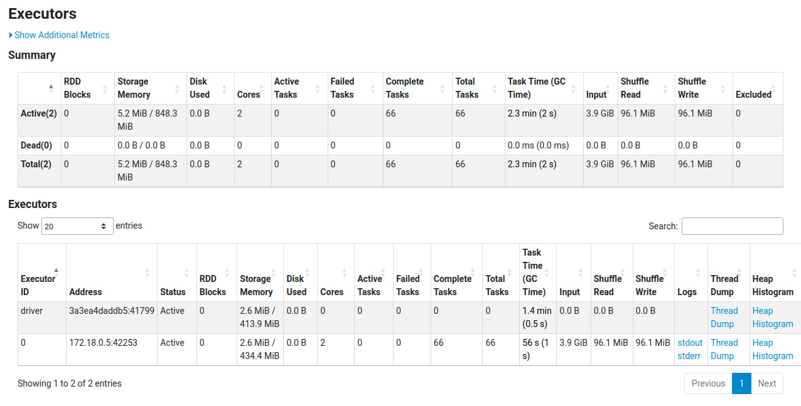

* Запуск `1Node_Opt-True`. Использование кэша позволило снизить объем чтения с диска в два раза, до `1.9 GiB`, а в памяти сохранилось `114.0 MiB` данных. Количество `Jobs` уменьшилось с 29 до 23, так как Spark перестал пересчитывать старые этапы. При этом репартиция данных увеличила количество `Tasks` до 88 и создала объемный обмен данными по сети на `142.7 MiB` (`Shuffle`). На эту подготовку ушло дополнительное время, но за счет дальнейшего чтения из оперативной памяти итоговое время снизилось до 26.72 сек.
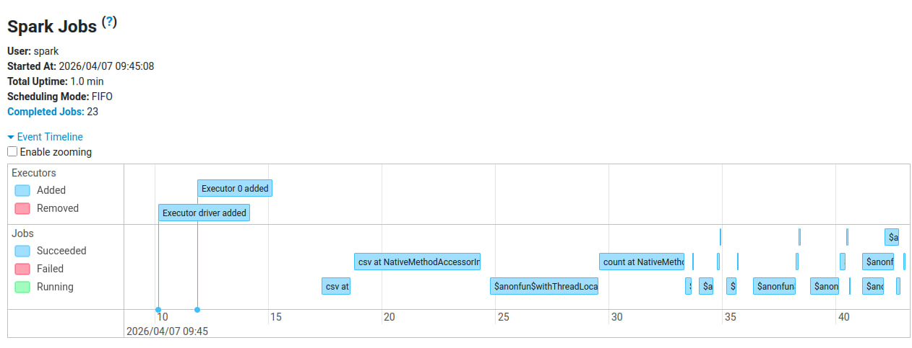
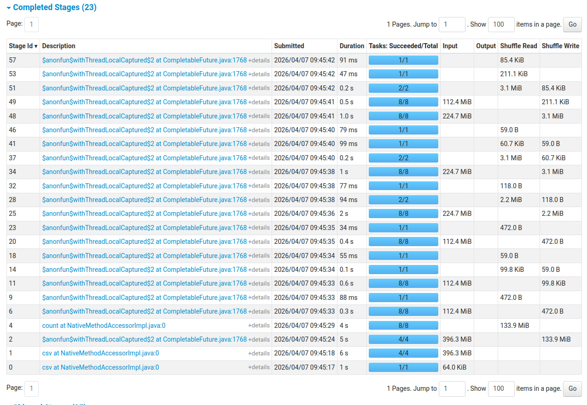
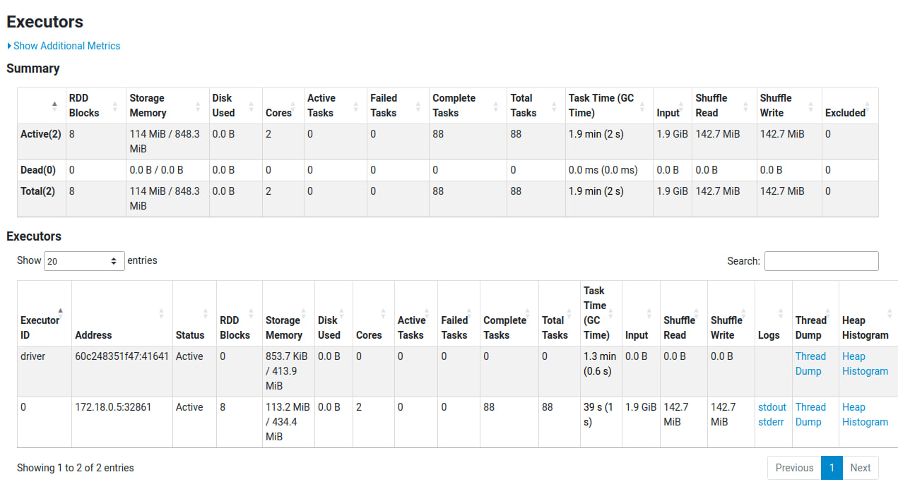

* Запуск `3Node_Opt-False`. Объем прочитанных данных `3.9 GiB` разделился поровну между тремя воркерами, по `1.3 GiB` на каждого. Данные по-прежнему не кэшируются (в памяти `8.4 MiB`) и Spark выполняет те же 29 `Jobs`, многократно обращаясь к диску. Но благодаря тому, что количество `Tasks` выросло до 106 и работа шла параллельно на трех машинах, время выполнения сократилось до 26.52 сек.
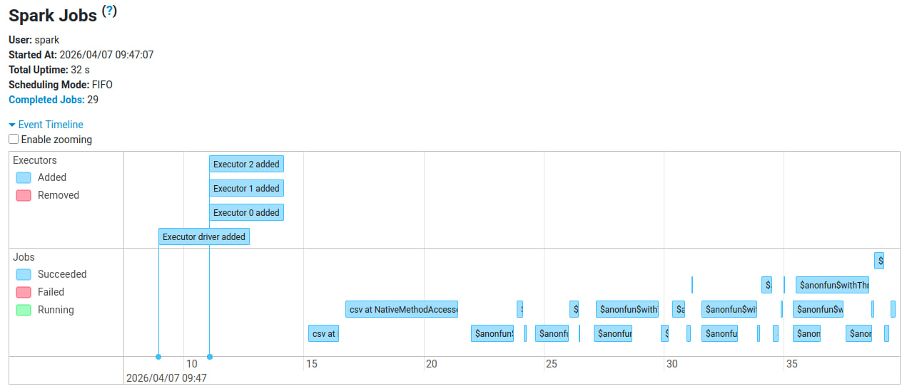
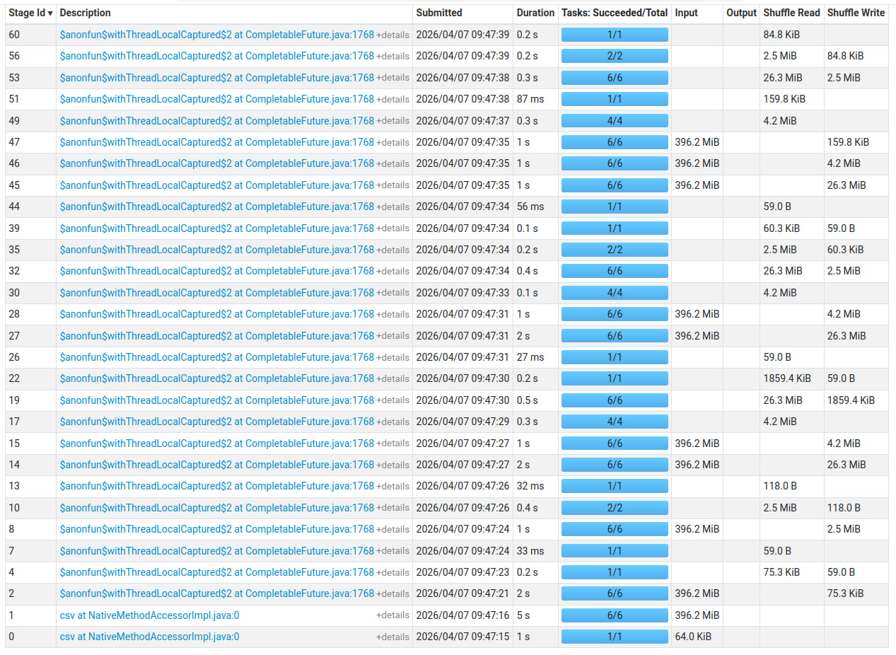
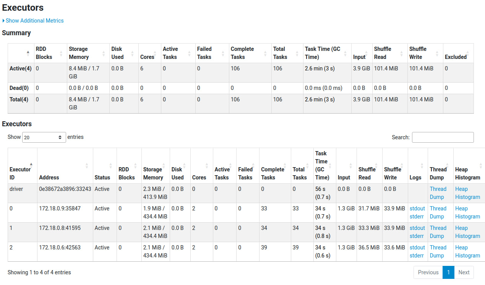

* Запуск `3Node_Opt-True`. Время выполнения составило 22.27 сек. За счет репартиции на 24 части (6 ядер по 4 партиции) общее количество `Tasks` выросло до 228. Закэшированные `113.5 MiB` данных и `144.3 MiB` сетевого обмена `Shuffle` равномерно распределились по трем машинам. Это позволило воркерам быстро обменяться данными и не создавать узких мест, как это было на одной ноде.
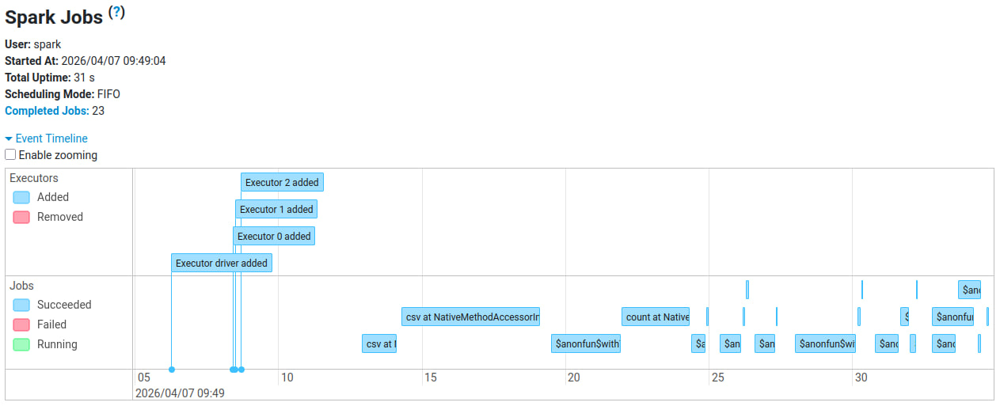
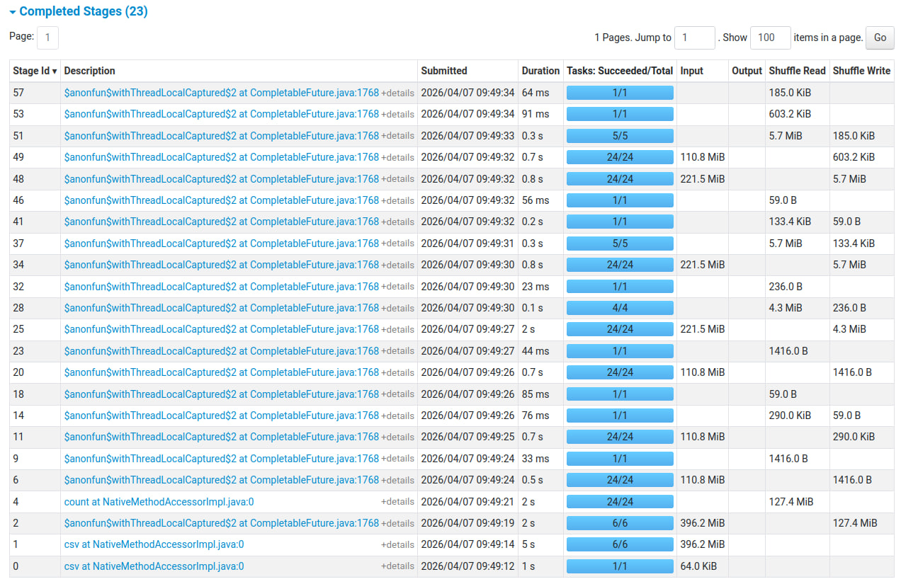
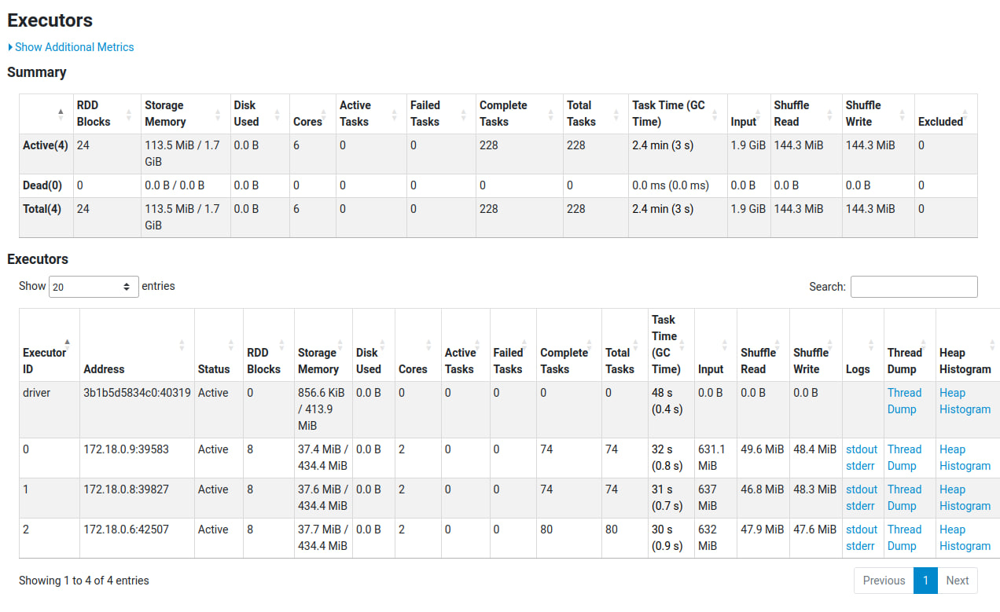

Результаты проверки масштабируемости с увеличенным в 3 раз датасетом (около 1.2 ГБ):

| Эксперимент       | Описание               | Время выполнения (сек) | Storage RAM (MB) |
| :---------------- | :--------------------- | ---------------------: | ---------------: |
| `1Node_Opt-False` | 1 узел, базовая версия |                  74.28 |            92.52 |
| `1Node_Opt-True`  | 1 узел, с оптимизацией |                  78.10 |            68.98 |
| `3Node_Opt-False` | 3 узла, базовая версия |                  57.59 |            84.26 |
| `3Node_Opt-True`  | 3 узла, с оптимизацией |                  34.62 |            86.71 |

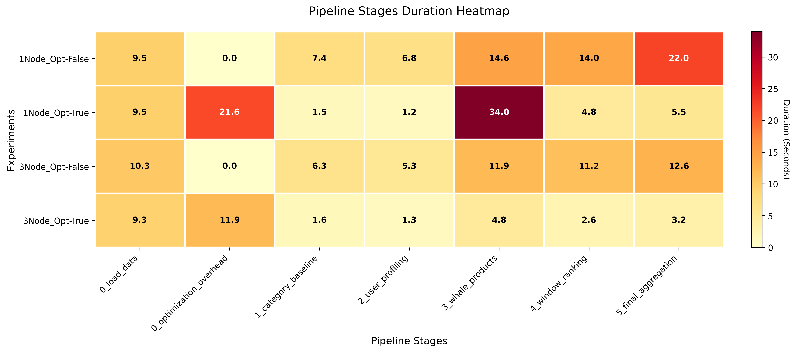

Анализ стресс-теста:

* На одной ноде запуск с оптимизацией оказался медленнее базового (78.10 сек против 74.28 сек). Причина в том, что одной машине не хватает ресурсов для быстрой перетасовки и кэширования 1.2 ГБ данных. Накладные расходы на `Shuffle` составили более 21 секунды, также при `Join` у нас расходы выросли космически до 34 секунд, что полностью перекрыло выгоду от использования кэша. В такой ситуации обычное чтение с диска сработало быстрее.
* На трех нодах запуск с оптимизацией показал время 34.62 сек, что в два раза быстрее базовой версии на одной машине. Три воркера распределили между собой задачи по обмену данными, поэтому накладные расходы на `Shuffle` составили около 11 секунд, а дальнейшие этапы отработали быстро за счет чтения из памяти.
* Общий вывод из экспериментов сводится к тому, что методы `.repartition()` и `.persist()` эффективны только если кластер обладает достаточным количеством машин для параллельной перетасовки данных. На слабом железе агрессивная подготовка данных может сделать программу медленнее, чем простое многократное чтение файла с жесткого диска.
