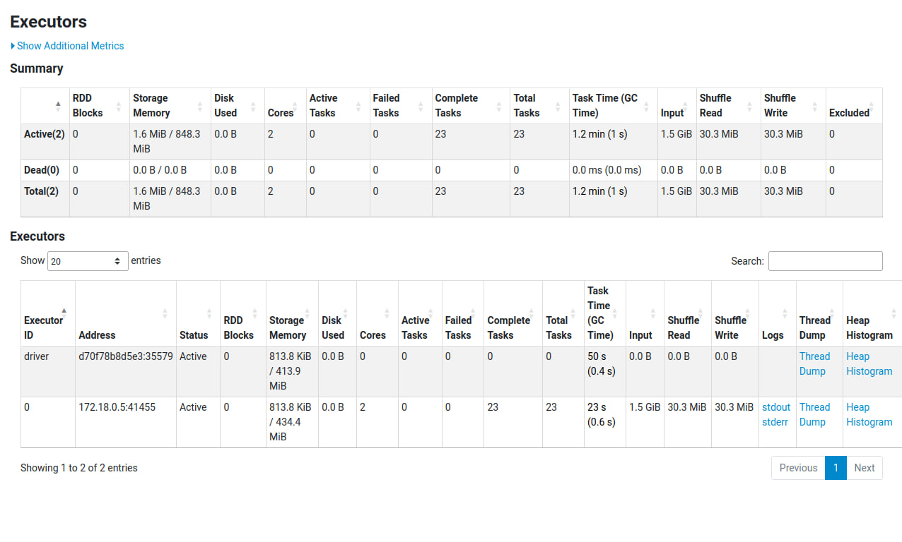
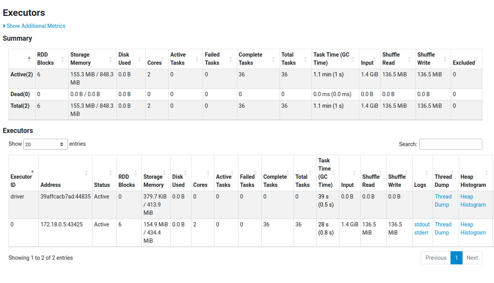
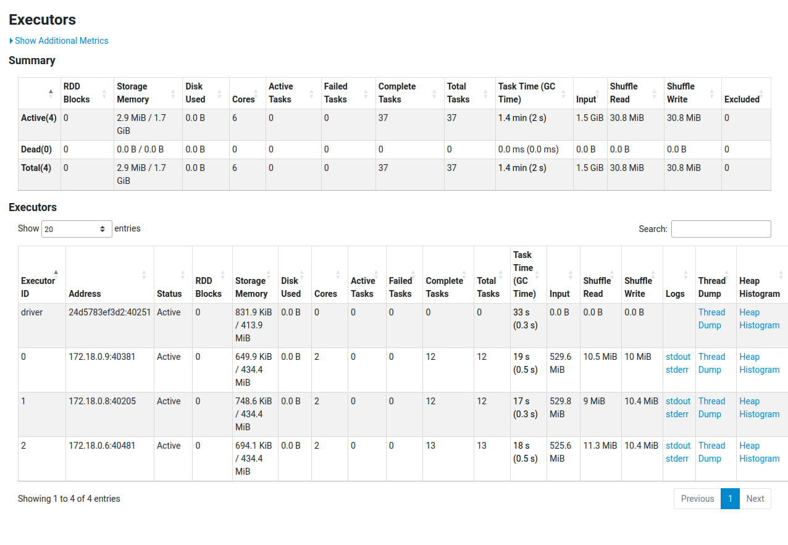
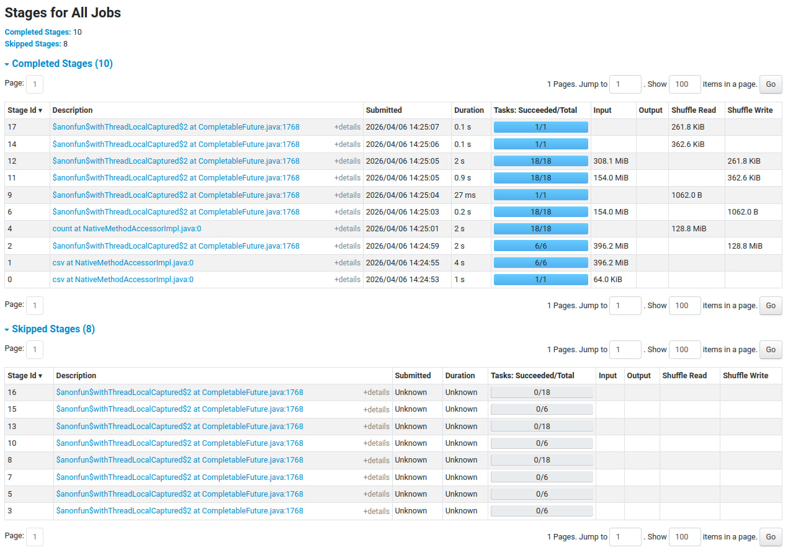

# spark-lab

## Постановка задачи

Целью данной лабораторной работы является развертывание распределенной файловой системы Hadoop (HDFS) и кластера вычислений Spark в среде Docker, а также анализ влияния методов оптимизации на производительность обработки данных.

В качестве исходных данных используется датасет [`e-commerce-events-history`](https://www.kaggle.com/datasets/mkechinov/ecommerce-events-history-in-cosmetics-shop) (история событий в магазине косметики) из прошлой лабораторной работы, содержащий более 1 миллиона строк (исходный вес примерно 400 МБ).

В качестве задачи, на которой проходили эксперименты, была выбрана следующая:
1) Сканирование всего датасета для вычисления базовой статистики по категориям (средняя цена и общее число действий).
2) Повторное сканирование данных для поиска «Китов» — самых активных пользователей (совершивших более 50 действий на сайте).
3) Объединение (`Join`) списка «Китов» с исходным датасетом для получения истории только их активности.
4) Агрегация любимых категорий «Китов» и финальное объединение с базовой статистикой магазина для сравнения.

Этот пайплайн требует многократного чтения одних и тех же данных и вызывает тяжелые операции перетасовки данных по сети (Shuffle), что идеально подходит для тестирования оптимизаций.

## Инструкция по запуску

В ходе лабораторной работы требуется запустить несколько экспериментов с разными параметрами. Далее будут представлены все необходимые для запуска команды, и также команды для проверки работы софта.

Сначала нужно скачать данные с гуглдиска (на гитхаб они не помещаются). Для этого достаточно выполнить команду:
```bash
./get_dataset.sh
```

Дождаться скачивания, после этого можно перейти к экспериментам.

Для того, чтобы завершить любой из экспериментов, просто нажмите `Ctrl+C` (для отмены `./run_experiment.sh`) в консоли и потом выполните:
```bash
docker compose down -v
```

Также, чтобы проверить производительность на больших массивах данных, есть ключ `--multiply N` у скрипта `./run_experiment.sh`. Он заставляет воркеров дублировать данные `N-1` раз (да, именно воркеров). С параметром `--multiply 5` можно уже попробовать получить представление о нагрузке данных для тех или иных конфигураций.

### Мониторинг

В проекте есть Hadoop и Spark. У обоих есть Web-интерфейс, с помощью которого можно глянуть разную статистику по обоим фреймворкам.

#### Hadoop

Чтобы открыть мониторинг Hadoop, посмотреть количество `NameNode`, работу `DataNode`, а также проверить наличие файлов в системе (и также глянуть количество блоков), достаточно зайти по следующему url:
- [http://localhost:9870](http://localhost:9870)


#### Spark

Также можно посмотреть все таски, выполняемые Spark, и состояние воркеров. Для этого нужно посетить [http://localhost:8081](http://localhost:8081).


Чтобы глянуть состояние определённой таски сразу же после выполнения (у вас 1 минута есть на отслеживание состояния), нужно перейти по адресу [http://localhost:4041/](http://localhost:4041/). Тут полезны два раздела -- Executors и Stages.


### Эксперименты

1. Эксперимент с базовым Hadoop (1 NameNode, 1 DataNode, 1 SparkWorker, без оптимизаций)
```bash
docker compose up -d
./setup_hdfs.sh
./run_experiment.sh
```

2. Эксперимент с базовым Hadoop и мощным Spark (1 NameNode, 1 DataNode, 1 SparkWorker, с оптимизацией)
```bash
docker compose up -d
./setup_hdfs.sh
./run_experiment.sh --optimized
```

3. Эксперимент с несколькими нодами (1 NameNode, 3 DataNode, 3 SparkWorker, без оптимизаций)
```bash
REPLICATION_FACTOR=3 docker compose up -d --scale datanode=3 --scale spark-worker=3
./setup_hdfs.sh
./run_experiment.sh --nodes 3
```

4. Эксперимент с несколькими нодами и оптимизированным Spark (1 NameNode, 3 DataNode, 3 SparkWorker, с оптимизациями)
```bash
REPLICATION_FACTOR=3 docker compose up -d --scale datanode=3 --scale spark-worker=3
./setup_hdfs.sh
./run_experiment.sh --nodes 3 --optimized
```

## Полученные результаты

### Основные метрики производительности

| Эксперимент       | Описание                 | Время выполнения (сек) | Storage RAM (MB) |
| :---------------- | :----------------------- | ---------------------: | ---------------: |
| `1Node_Opt-False` | "1 узел, базовая версия" |                  17.37 |             1.55 |
| `3Node_Opt-False` | "3 узла, базовая версия" |                  15.20 |             2.86 |
| `1Node_Opt-True`  | "1 узел, с оптимизацией" |                  20.32 |           155.34 |
| `3Node_Opt-True`  | "3 узла, с оптимизацией" |                  18.31 |           155.20 |

### Расширенная статистика (на основе Web UI)

Для глубокого понимания процессов были проанализированы вкладки `Executors` и `Stages`. Ниже представлена таблица с внутренними метриками кластера для каждого эксперимента:

| Эксперимент       | Прочитано данных (Input) | Данные в кэше (Storage Memory) | Shuffle Read | Shuffle Write |
| :---------------- | -----------------------: | -----------------------------: | -----------: | ------------: |
| `1Node_Opt-False` |                  1.5 GiB |                        1.6 MiB |     30.3 MiB |      30.3 MiB |
| `1Node_Opt-True`  |                  1.4 GiB |                      155.3 MiB |    136.5 MiB |     136.5 MiB |
| `3Node_Opt-False` |                  1.5 GiB |                        2.9 MiB |     30.8 MiB |      30.8 MiB |
| `3Node_Opt-True`  |                  1.4 GiB |                      155.2 MiB |    129.4 MiB |     129.4 MiB |

---

### Подробный разбор экспериментов

#### Эксперимент 1: Базовый запуск на 1 ноде (1Node_Opt-False)

**Ключевые особенности:**
* Spark работает «в потоке»: считывает данные, вычисляет агрегацию и сразу удаляет их из памяти (в кэше всего `1.6 MiB`).
* Из-за отсутствия кэширования ленивый Spark вынужден читать HDFS-файлы заново для каждой ветки вычислений. Суммарный объем прочитанных данных (`Input`) составил `1.5 GiB` при реальном весе датасета ~400 МБ (то есть он 4 раза читает датасет).
* Объем перетасовки данных (`Shuffle`) небольшой (`30.3 MiB`).
* То есть в данном случае у нас получилось достаточно мало данных, из-за чего базовый случай хорошо отработал.




#### Эксперимент 2: Запуск с оптимизацией на 1 ноде (1Node_Opt-True)

**Ключевые особенности:**
* Метод `.cache()` отработал успешно: `155.3 MiB` сжатых данных легли в оперативную память `Storage Memory`. Это снизило нагрузку на чтение с жесткого диска.
* Вызов `.repartition("user_id")` принудительно заставил Spark отсортировать и перетасовать весь датасет по пользователям, отчего произошёл `shuffle write` на 136 мбайт.
* Накладные расходы на сортировку и шафл превысили пользу от кэширования, поэтому время выполнения увеличилось с 17.37 до 20.32 секунд.
* Также можно было заметить, что даже при сниженном количестве чтения датасета (всего 2 вместо 4), у нас появились накладные расходы на `shuffle`, отчего выигрыша от такой оптимизации не оказалось.




#### Эксперимент 3: Базовый запуск на 3 нодах (3Node_Opt-False)

**Ключевые особенности:**
* **Победитель по скорости (15.20 сек).** Увеличение числа вычислительных узлов дало небольшое ускорение благодаря параллельной работе 3-х процессоров.
* Данные по-прежнему не кэшируются (в памяти `2.9 MiB`), а общий `Input` составляет `1.5 GiB`.
* `Shuffle Write` остается низким (`30.8 MiB`), так как Spark распределяет задачи между воркерами без жесткой привязки к конкретным ключам партицирования.




#### Эксперимент 4: Запуск с оптимизацией на 3 нодах (3Node_Opt-True)

**Ключевые особенности:**
* Память кэша (`155.2 MiB`) идеально равномерно распределилась по трем воркерам (примерно по `51 MiB` на каждый узел).
* Принудительная группировка данных `.repartition("user_id")` заставила воркеры активно пересылать данные друг другу по виртуальной сети Docker. При том без ключа `user_id` производительность падает ещё на 2 секунды.
* Сетевой обмен огромным объемом данных (`Shuffle Write` составил `129.4 MiB`) занял больше времени, чем параллельные вычисления. Из-за этого время выполнения (18.31 сек) оказалось хуже, чем у базовой версии на 3 нодах.




#### Побочные эксперименты

Так как у нас была проблема с тем, что 400 МБ данных было недостаточно для проверки масштабируемости кластера, в скрипт был добавлен ключ `--multiply N`. С его помощью размер датасета искусственно увеличивается в памяти (дублируется) перед выполнением бизнес-логики.

Ниже представлена статистика для запуска с ключом `--multiply 5` (итоговый размер обрабатываемых данных составил около ~2 ГБ). Эти результаты наглядно доказывают, что оптимизация и масштабирование кластера начинают работать только на объемах данных, превышающих определенный порог.

| Эксперимент       | Описание               | Время выполнения (сек) | Storage RAM (MB) |
| :---------------- | :--------------------- | ---------------------: | ---------------: |
| `1Node_Opt-False` | 1 узел, базовая версия |                  46.00 |             2.07 |
| `1Node_Opt-True`  | 1 узел, с оптимизацией |                  56.01 |             0.62 |
| `3Node_Opt-False` | 3 узла, базовая версия |                  36.79 |             3.77 |
| `3Node_Opt-True`  | 3 узла, с оптимизацией |                  35.27 |           647.33 |


Какую информацию можно вывести из этой статистики?

1. При увеличении количества данных распараллеливание данных на 3 ноды (и воркера) дало более существенный буст, чем 2 секунд (на 20%).

2. Самым быстрым оказался запуск `3Node_Opt-True` (35.27 сек), хотя можно сослаться на то, что он работает в пределах погрешности из-за того, что перегоняет данные с диска в оперативную память и назад. Памяти трех воркеров хватило, чтобы вместить закэшированные данные (647.33 МБ), но всё равно работает дольше, чем требовалось из-за оверхеда по записи.

3. Оптимизированный запуск на 1 ноде показал худшее время (56.01 сек), а кэш оказался почти пустым (0.62 МБ). Возможно, проблема в том, что 780 мбайт shuffle оказались слишком тяжёлыми, и оверхдер от их движения оказался сильно тяжелее, чем должен был, отсюда и такое замедление. То есть можно сказать, что оптимизация и кэширование для одной ноды работают не так эффективно, как хотелось бы, по крайней мере на нашей задаче с большим количество join-ов.
